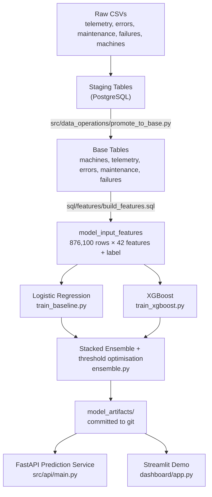
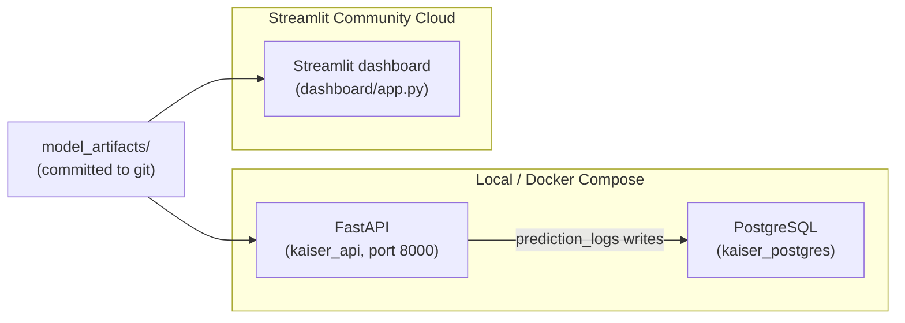

# Architecture

## Pipeline

Every feature in `model_input_features` is computed strictly from data at or before `observation_time` — see [FEATURE_ENGINEERING.md](FEATURE_ENGINEERING.md) for the window definitions and [`tests/test_feature_leakage.py`](../tests/test_feature_leakage.py) for the automated guard against regressions.

## Deployment topology

Two independent runtimes consume `model_artifacts/`, neither depends on the other:

The API's database dependency is limited to writing `prediction_logs` in a background task — model loading and inference do not require Postgres to be reachable. The Streamlit demo has no database dependency at all, which is why its "Live Demo" tab runs on 20 hardcoded machine profiles rather than live rows (Streamlit Community Cloud has no database access) — see the README's [Design Notes](../README.MD#design-notes).
